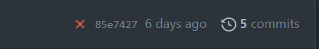

# First web page assignment

Host a basic index.html file on Github Pages. Include favicons and make sure that the page validates with no errors or warnings.

**Prerequisites**:

- VS Code installed and configured.
- This Github Classroom assignment accepted and a repo of it created on your IS-120 Github account.

| :warning: Extra files                                                                                                                                                                    |
| :--------------------------------------------------------------------------------------------------------------------------------------------------------------------------------------- |
| The repo has extra files (two json files and `test` and `.github` folders) for automated testing. Except for images in the `images` folder, don't delete files that you haven't created. |

| ✨ **BONUS:** Assignment walk through video]                                                                                                                                                                                                                                                                                                                                                                                |
| :-------------------------------------------------------------------------------------------------------------------------------------------------------------------------------------------------------------------------------------------------------------------------------------------------------------------------------------------------------------------------------------------------------------------------- |
| [](https://youtu.be/yBktZhp09kg)                                                                                                                                                                                                                                                                                                                                                     |
| <p>_Helpful if you are new to VS Code, Git, and Github. Follow along while you complete the assignment._</p><p>**NOTE:** At the end of the video, I took a screenshot of the `validator.nu` output. While you still need to run your site through `validator.nu` to check for errors, you no longer need to screenshot your validator output anymore. I've added a test in the repo to indicate that validation passed.</p> |

## :large_orange_diamond: Git

You need to use the Git software tool to upload your files to Github so that they can be hosted on Github Pages. Follow along in my [Installing and configuring git](https://youtu.be/NFlwNFBTw4c) video to learn how to install Git on your computer and then configure your Git username, email, and, finally, set the first branch name to "main".

## :pencil: Clone this assignment repo to VS Code

At the top right of your repo, find and click on the Code button and copy the URL in the HTTPS field (see image below)
)

Open VS Code, and choose "Clone Git repository" on the welcome screen or in the command palette, `View -> Command Palette...`. Paste the URL, select a folder on your computer to copy the files, and when prompted, open the local copy of the repo in VS Code.

## :page_facing_up: Create and personalize your index.html file

Open the `index.html` file in VS Code.

The file should be empty. Type an exclamation point `!` and press `Tab` to create the basic structure of an HTML file. You should see the following markup appear in the file:

```
<!DOCTYPE html>
<html lang="en">
<head>
  <meta charset="UTF-8">
  <meta http-equiv="X-UA-Compatible" content="IE=edge">
  <meta name="viewport" content="width=device-width, initial-scale=1.0">
  <title>Document</title>
</head>
<body>

</body>
</html>
```

### Configuring `<head>`

- In the `<head>` section, find the `<title>` element and add a title for your page. Name it anything you'd like &ndash; "First web page" is fine, but creativity is fun.
- Let's add a description of your site that will appear on search engine results. Keep your description under 150 characters.
  - In the `<head>` above `<title>` enter a new line
  - On the new line, type `meta:desc` and press `TAB`. The following HTML should appear:<br> `<meta name="description" content="">`
  - Add a description of your page between the double quotes of the content attribute

### Adding `<body>` content

- Add a heading. Below the `<body>` tag, type `h1` and press `TAB`
- Add some heading text between the `<h1>` tags. Heading text is important for search engine optimization. Choose a heading that accurately describes your page.
- On a new line below your `<h1>`, type `p` and press `TAB`
- Add some text inside the `<p>` tags.
- Save your file

## :computer: Use Live Server to preview your webpage

Before you open your webpage in Live Server, check the bottom left info bar on VS Code. You want to make sure you don't have any errors or warnings which should look like this:<br><br>
<br><br>
If you have errors or warnings, click on the icons to see what they are and fix them.

Once any problems are fixed, either choose "Go Live" in the VS Code bottom info panel, or find and select "Go Live" in `View -> Command Palette...` to view your webpage in a browser.

## :grin: Add favicons

Let's add some favicons. You've seen favicons in browser tabs, bookmarks, and on mobile devices. Favicons are the small icons that appear in these, and other, places. They are important for branding and for making your site look professional.

1. Use [RealFaviconGenerator](https://realfavicongenerator.net/) to generate your favicons. If you upload a PNG for your favicon, make sure that it is a free image or it is an image you created.
2. At the bottom of the page select "I cannot or I do not want to place favicon files at the root of my web site. Instead I will place them here:" and enter `./images/` as the path for your favicons.
3. Click the button to generate your favicons and HTML code.
4. After downloading the favicons, copy the `favicon.ico` file to the root folder where your `index.html` file is. `favicon.ico` is a throwback to original favicons. Most browsers prefer higher-res images, which we will place in the `images` folder. Copy the rest of the favicon files into the images folder. (You can delete the `placeholder.ico` file in the `images` folder.)
5. Copy the the generated markup into `<head>`.
6. Make sure the paths in the markup you just pasted direct to the browser to your `images` folder. For example, instead of<br>
   `href="/apple-touch-icon.png"`<br>
   you should have<br>
   `href="./images/apple-touch-icon.png"`<br>
   Check this path for all the favicon `href` attributes except for the `favicon.ico` one. Change the `favicon.ico` path to simply<br>
   `<link rel="shortcut icon" href="favicon.ico">`
   <br>
   _Notice I also included a period or `.` before the first slash. Servers do not need the prefixed period, but Github pages does need it._

## Check for errors and warnings, then view your page again using Live Server

If everything looks good then.....

## :arrow_up: Use VS Code's Source Control (in the sidebar) to commit your changes and sync these changes to Github

Open the repo in Github and check that you've passed the automated tests. Look at the top right of your repo header. If you have passed all the tests, you'll see a green check mark:


If you failed any tests, you will see a red X. Click on the X to see which test failed. Click on the failed test name for more details.



If you see a yellow dot, it means that the test is still running. Wait for the test to finish.

### Current automated tests

- HTML validation
- HTML proofer
- `<head>` should have a `<title>`
- `<head>` should have a `<meta>` description element
- `index.html` should contain an `<h1>`
- `index.html` should contain a `<p>`
- `index.html` should contain favicon information

## :rocket: Publish your site on Github pages

After you publish your site, wait a few minutes for it to generate. After it's generated, paste the link into your repo's about section. Also, feel free to delete the contents of `README.md` file from your repo. Change the `README.md` to add a description of your site. You can still view the original `README.md` file in the Feedback branch on Github.

## :no_entry_sign: Check that your site validates with no errors

Navigate to [Validator.nu](https://validator.nu/) and paste your Github Pages URL into the text field. Select "Show outline" and "Show image report." Click the "Check" button. If you have no errors or warnings, you're good to go! Take a screenshot of your validation report and add it the Feedback Pull-Request comment (see below).

## :speech_balloon: Leave a comment on the Feedback Pull-Request

On your Github repo, navigate to the Feedback pull requests. At the bottom of the page you will find a comment field. Leave a comment asking us to review your previous commit. Include your validator screenshot.
